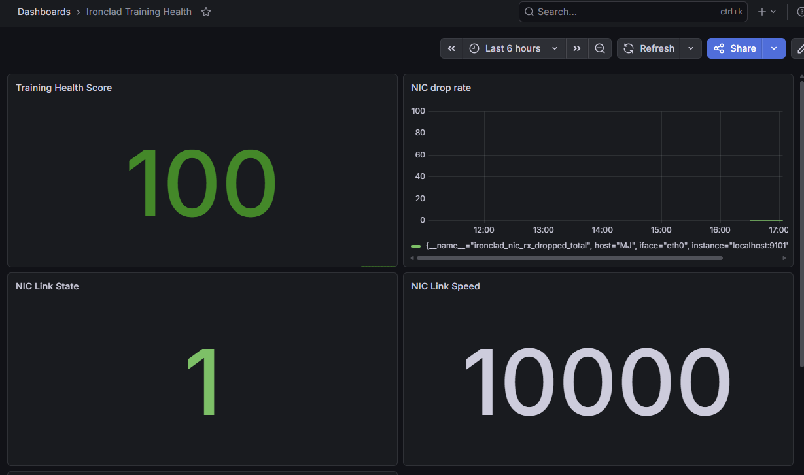
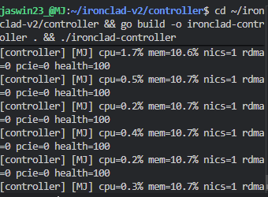
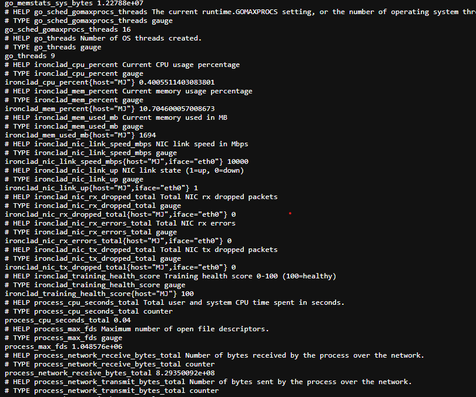

# ironclad-v2

SmartNIC-aware distributed training health monitor. Reads the Linux kernel directly,no cloud and Docker.

## Screenshots







## What it does

ironclad-v2 monitors the full networking stack of a Linux host and computes a real-time training health score. It detects the failure modes that silently kill distributed AI training jobs before they cause a full job stall.

**Failure modes detected:**
- Silent link degradation — NIC reports `up` but running below max speed
- Packet loss on training fabric — any rx/tx drops trigger alerts
- PCIe link degradation — GPU or NIC negotiated below max width/speed
- RoCE congestion storms — CNP send rate spikes indicate DCQCN thrashing
- RDMA sequence errors — packet reordering or drops at the RDMA layer
- NIC queue starvation — rx missed errors from hardware buffer exhaustion

## Architecture

The **agent** (Rust) runs on each monitored host as a systemd service. It reads NIC counters from `/sys/class/net/`, RDMA counters from `/sys/class/infiniband/`, and PCIe link state from `/sys/bus/pci/devices/`. Metrics are serialized to JSON and streamed over a Unix socket.

The **controller** (Go) receives the JSON stream, computes a 0-100 training health score, fires alerts on threshold violations, and exposes a Prometheus-compatible `/metrics` endpoint on port 9101.

Grafana queries Prometheus to visualize health score, NIC drop rate, link state, and PCIe degradation over time.
agent (Rust) → Unix socket → controller (Go) → Prometheus → Grafana

## Stack

- **Agent:** Rust, Tokio, sysinfo, serde
- **Controller:** Go, Prometheus client
- **IPC:** Unix domain sockets
- **Observability:** Prometheus + Grafana
- **Service management:** systemd

## Metrics exposed

| Metric | Description |
|--------|-------------|
| `ironclad_training_health_score` | Composite health score 0-100 |
| `ironclad_nic_link_up` | NIC link state per interface |
| `ironclad_nic_link_speed_mbps` | NIC link speed in Mbps |
| `ironclad_nic_rx_dropped_total` | Cumulative rx drops |
| `ironclad_nic_tx_dropped_total` | Cumulative tx drops |
| `ironclad_nic_rx_errors_total` | Cumulative rx errors |
| `ironclad_pcie_degraded` | PCIe link degraded flag |
| `ironclad_pcie_link_width_current` | Current PCIe link width |
| `ironclad_rdma_cnp_sent_total` | RoCE congestion notifications sent |
| `ironclad_rdma_packet_seq_errors_total` | RDMA sequence errors |
| `ironclad_rdma_slow_restart_total` | RoCE slow restarts |

## Health score

The controller computes a health score every 2 seconds:

| Condition | Penalty |
|-----------|---------|
| NIC link down | -40 |
| Any rx/tx drops | -20 |
| Any rx/tx errors | -10 |
| Missed packets | -15 |
| PCIe degraded | -25 |
| RDMA receive errors | -15 |
| RDMA sequence errors | -25 |
| RoCE congestion | -10 |

Score floor is 0. Grafana thresholds: green ≥ 90, yellow ≥ 70, red < 70.

## Running

**Agent:**
```bash
cd agent && cargo build --release
sudo cp systemd/ironclad-agent.service /etc/systemd/system/
sudo systemctl enable --now ironclad-agent
```

**Controller:**
```bash
cd controller && go build -o ironclad-controller .
./ironclad-controller
```

**Metrics endpoint:**
http://localhost:9101/metrics

## Grafana dashboard

Import `dashboard/ironclad-training-health.json` into Grafana with Prometheus as the data source pointed at `localhost:9090`.

## Simulation

Packet loss simulation requires bare-metal Linux or a VM with a real NIC driver. WSL's virtual network stack does not propagate netem drops to sysfs counters.

On bare-metal:
```bash
sudo tc qdisc add dev eth0 root netem loss 0.1%
# watch health score drop in Grafana
sudo tc qdisc del dev eth0 root
```

## Tests

```bash
cd agent && cargo test
cd controller && go test
```

## Origin

Built on top of [ironclad](https://github.com/Jaswin2302/ironclad) — a bare-metal Linux fleet monitor.
